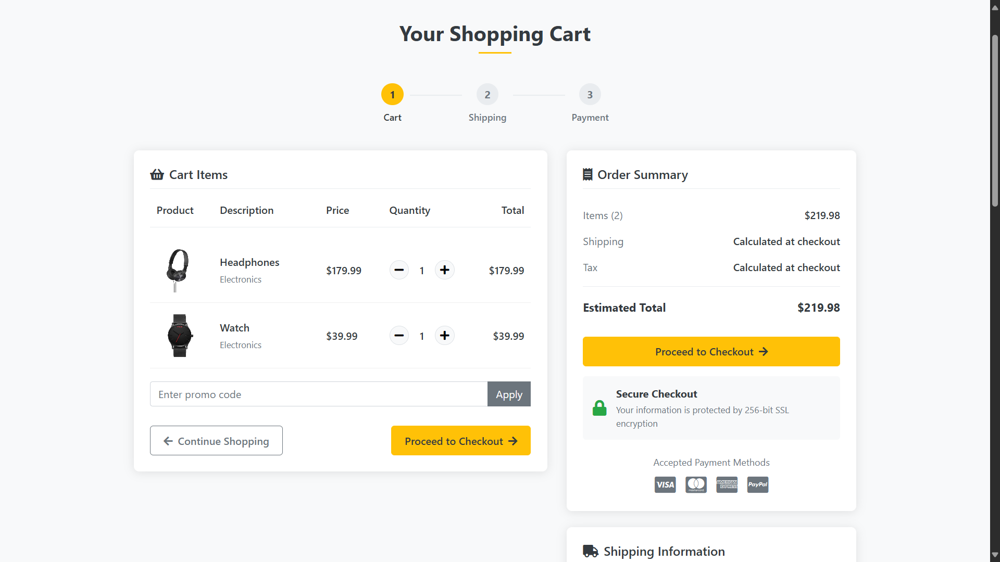
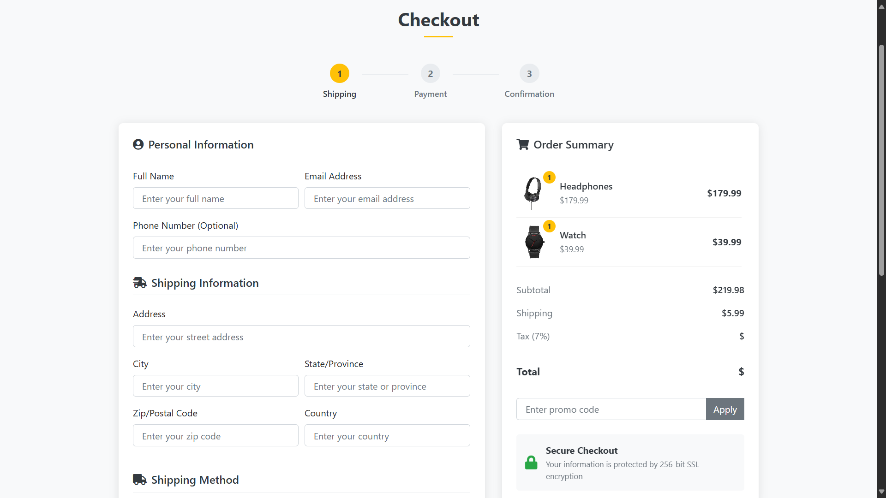

# 🛒 Django E-Commerce Website

This is a fully functional **eCommerce website** built with **HTML, CSS, JavaScript** on the frontend and **Django** on the backend. The site simulates a complete online shopping experience, including product browsing, user authentication, cart management, and admin controls.

---

## 🚀 Features

### 🏬 Store
- All products are listed in a clean, responsive store section.
- Each product includes details like image, price, and description.
- Add-to-cart functionality (demo).

### 🔥 Deals Section
- Highlight the latest deals and promotions.
- Dynamic section to keep users updated on discounts or featured products.

### 📂 Categories
- Shop by categories for a more personalized and user-friendly experience.
- Easily filter products by type.

### 👤 Authentication
- **Demo Login** and **Sign Up** pages with working Django-based authentication.
- Session management with login/logout support.

### 💳 Checkout & Shipping (Demo)
- Simulated checkout page for reviewing cart items.
- Demo shipping form to simulate address entry and order confirmation.

### 🛠 Admin Controls
- Admin dashboard to:
  - Manage Products (Add, Edit, Delete)
  - Manage Customers
  - Manage Deals and Promotions

---

## 🛠 Tech Stack

- **Frontend**: HTML, CSS, JavaScript
- **Backend**: Django (Python)
- **Database**: Default Django SQLite (can be configured for PostgreSQL/MySQL)

---

## 📸 Screenshots





---

## 🧪 Demo Credentials

- ### You can use your MySQL credentials to test the site
- ### Do not forget to add your products initially from the admin panel to display the products in the website


## Installation:

1. Clone repo: 
    ```git clone <repo_url>```

2. Creating virtual environment: 
    ```python -m venv venv```
    ```source venv/bin/activate```  # On Windows: venv\Scripts\activate

3. Install dependencies: 
    ```pip install -r requirements.txt```

4. Migrating tables: 
    ```python manage.py makemigrations```
    ```python manage.py migrate```

5. Creating superuser for admin access:
    ```python manage.py createsuperuser```

6. Run server: 
    ```python manage.py runserver```

Visit http://127.0.0.1:8000/ to view the site locally.


## 📬 Feedback & Contributions
If you'd like to contribute or report a bug, feel free to open an issue or submit a pull request.

## 📄 License
This project is licensed under the MIT License.